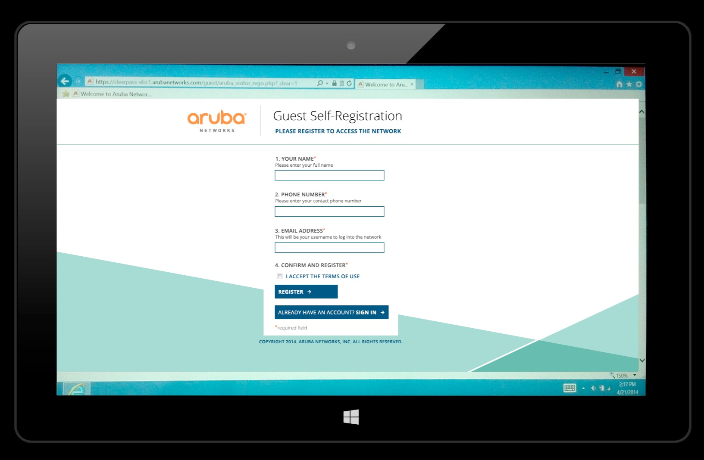

**ClearPass**

**ClearPass** นั้นเป็นส่วนของหนึ่งของอุปกรณ์ยี่ห้อ Aruba ซึ่งเป็นระบบการบริหารจัดการการควบคุมการเข้าถึงการใช้งานบนเครือข่ายทั้งในส่วนของ Wire, Wireless และ VPN เพราะในปัจจุบันนี้ทุกคนก็จะมีอุปกรณ์เครื่องมือสื่อสารส่วนตัวใช้งานและมีการนำอุปกรณ์ส่วนตัวเหล่านั้นเข้ามาใช้งานในองค์กรด้วย ซึ่งเราจะเรียกอุปกรณ์ประเภทนี้ว่า Bring Your Own Devices (BYOD) และเมื่อผู้ใช้งานนำอุปกรณ์ BYOD นี้เข้ามาใช้งานกับระบบในองค์กรเราจะทำอย่างไรเพื่อที่จะสามารถกำหนด ควบคุม และ ติดตามดูอุปกรณ์ได้ โดยมีการสร้างนโยบายเพื่อรักษาความปลอดภัยเมื่อมีการเข้าถึงระบบเครือข่ายได้ในระดับอุปกรณ์และผู้ใช้งาน สำหรับ ClearPass Policy Manager นั้นมีส่วนประกอบอยู่ 3 ส่วนคือ

* ClearPass Guest ใช้สำหรับบริหารจัดการการเข้าถึงระบบเครือข่ายของผู้ใช้งานชั่วคราว (Guest Access)

* ClearPass Onboard ใช้สำหรับตั้งค่าและกำหนดค่าเริ่มต้นของอุปกรณ์พกพาให้สามารถเชื่อมต่อกับระบบเครือข่ายขององค์กรได้อย่างมั่นคงปลอดภัย

* ClearPass OnGuard ใช้สำหรับตรวจสอบอุปกรณ์เพื่อให้ผ่านข้อกำหนดขององค์กรก่อนทำการเชื่อมต่อเข้าสู่ระบบ

โดยในที่นี้เราจะมาพูดถึงกันแค่ในส่วนของ ClearPass Guest เท่านั้นเพื่อให้เชื่อมโยงกับเรื่องของการทำ Authentication

**ClearPass Guest** เป็นการบริหารจัดการผู้ใช้งานชั่วคราว (Guest, Visitor) ที่ให้บริการ Workflow สำหรับให้ผู้ใช้ เช่น แขก ผู้รับเหมา คู่ค้า คนเดินห้าง หรือผู้ที่ต้องการเชื่อมต่อ Wi-Fi ผ่านอุปกรณ์พกพา สามารถเข้าถึงระบบเครือข่ายได้โดยอัตโนมัติ ซึ่งระบบนี้จะให้บริการในระบบ AAA (Authentication, Authorization, Accounting) สามารถจัดทำ Profile,Report และ ควบคุมการสิทธิ์การเข้าถึงระบบเครือข่ายได้ โดยรองรับการ Authentication ของผู้ใช้งานชั่วคราวได้ด้วยวิธี

* Captive Portal เป็นการให้ผู้ใช้งานชั่วคราวสามารถที่จะลงทะเบียนขอใช้งานระบบเครือข่ายได้ด้วยตนเอง (Self-Registration) ซึ่งทำให้ลดความยุ่งยากในการขอเข้าใช้งานระบบ โดยผู้ขอใช้งานสามารถกรอกข้อมูลเบื้องต้นแล้วกดส่ง Register เพื่อเป็นการส่ง email ไปยังผู้ดูแลระบบ และเมื่อผู้ดูแลระบบเห็นข้อมูลที่ร้องขอการเข้าใช้งานก็สามารถที่จะเลือกอนุญาตหรือไม่อนุญาตให้บุคคลนั้นเข้าใช้งานระบบเครือข่ายหรือไม่

* Social Login ผู้ใช้งานชั่วคราวสามารถที่จะเลือกใช้ Facebook, Twitter หรือ G-mail ในการพิสูจน์ตัวตนเพื่อขอใช้งานระบบเครือข่ายได้ ในส่วนนี้ก็เหมาะกับร้านค้าหรืองานอีเวนท์ที่มีคนเข้ามาขอใช้งานในปริมาณมาก

