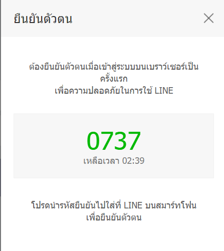
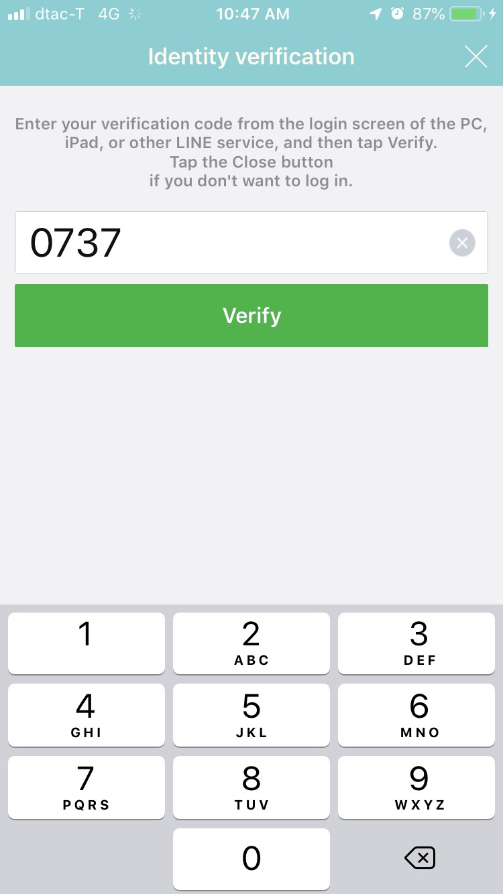

**Verify that time-based OTP can be used only once within the validity period**

**Preconditions:**

* Line Account

* Application Line on PC

* Application Line on mobile

**Input:**

* Username and Password from Line account
    

**Action:**

* Input OTP from PC on Application Line mobile

**Expect Result:**

* Can access on Line PC
